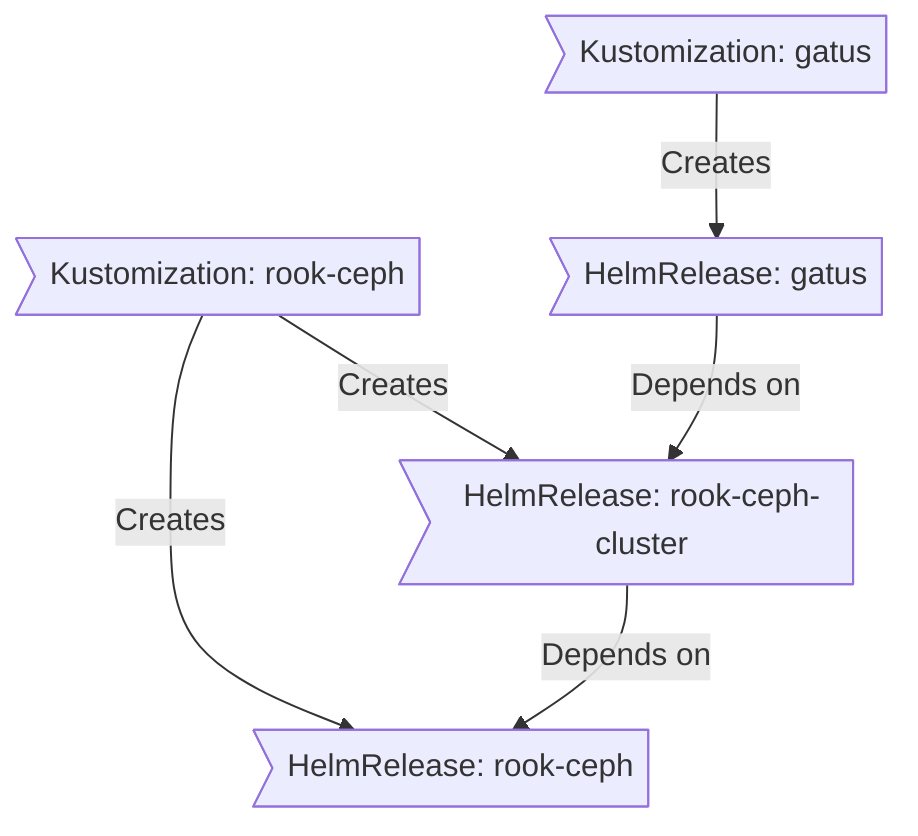

# igloo


### Kubernetes based home network 🐧
<br/>
<br/>
<br/>

[](https://github.com/siderolabs/kubelet/pkgs/container/kubelet)
<br/>


## Overview
- [Kubernetes](#-kubernetes)
- [Hardware](#-hardware)
- [Software](#software)
- [Cluster Notes](#cluster-notes)
- [Thanks](#-thanks)

This is a mono repository for my home infrastructure and Kubernetes cluster. I try to adhere to Infrastructure as Code (IaC) and GitOps practices using tools like [Kubernetes](https://kubernetes.io/), [Flux](https://github.com/fluxcd/flux2), [Renovate](https://github.com/renovatebot/renovate), and [GitHub Actions](https://github.com/features/actions).

---

## 💻&nbsp; Kubernetes
My Kubernetes cluster is deployed with [Talos](https://www.talos.dev). This is a semi-hyper-converged cluster, workloads and block storage are sharing the same available resources on my nodes while I have a separate server with ZFS for NFS/SMB shares, bulk file storage and backups.


### Core Components
- [actions-runner-controller](https://github.com/actions/actions-runner-controller): Self-hosted Github runners.
- [cert-manager](https://github.com/cert-manager/cert-manager): Creates SSL certificates for services in my cluster.
- [cilium](https://github.com/cilium/cilium): Internal Kubernetes container networking interface.
- [cloudflared](https://github.com/cloudflare/cloudflared): Enables Cloudflare secure access to certain ingresses.
- [external-dns](https://github.com/kubernetes-sigs/external-dns): Automatically syncs ingress DNS records to a DNS provider.
- [external-secrets](https://github.com/external-secrets/external-secrets): Managed Kubernetes secrets using [1Password Connect](https://github.com/1Password/connect).
- [ingress-nginx](https://github.com/kubernetes/ingress-nginx): Kubernetes ingress controller using NGINX as a reverse proxy and load balancer.
- [rook](https://github.com/rook/rook): Distributed block storage for persistent storage.
- [sops](https://github.com/getsops/sops): Managed secrets for Kubernetes and Terraform which are committed to Git.
- [spegel](https://github.com/spegel-org/spegel): Stateless cluster local OCI registry mirror.
- [volsync](https://github.com/backube/volsync): Backup and recovery of persistent volume claims.


### GitOps
[Flux](https://github.com/fluxcd/flux2) watches the clusters in my [kubernetes](./kubernetes/) folder (see Directories below) and makes the changes to my clusters based on the state of my Git repository.

The way Flux works for me here is it will recursively search the `kubernetes/apps` folder until it finds the most top level `kustomization.yaml` per directory and then apply all the resources listed in it. That aforementioned `kustomization.yaml` will generally only have a namespace resource and one or many Flux kustomizations (`ks.yaml`). Under the control of those Flux kustomizations there will be a `HelmRelease` or other resources related to the application which will be applied.

[Renovate](https://github.com/renovatebot/renovate) watches my **entire** repository looking for dependency updates, when they are found a PR is automatically created. When some PRs are merged Flux applies the changes to my cluster.


### Repository structure

```sh
📁 .github         # GH Actions configs, repo reference objects, renovate config
📁 kubernetes      # Kubernetes cluster defined as code
├─📁 apps          # Applications deployed into the cluster grouped by namespace
├─📁 components    # Re-useable Kustomize components
└─📁 flux          # Flux system configuration
```


### Flux Workflow
This is a high-level look how Flux deploys my applications with dependencies. In most cases a `HelmRelease` will depend on other `HelmRelease`'s, in other cases a `Kustomization` will depend on other `Kustomization`'s, and in rare situations an app can depend on a `HelmRelease` and a `Kustomization`. The example below shows that `gatus` won't be deployed or upgrade until the `rook-ceph-cluster` Helm release is installed or in a healthy state.



### 🌐&nbsp; Networking
This cluster uses two instances of [ExternalDNS](https://github.com/kubernetes-sigs/external-dns) running. One for syncing private DNS records to my `UDM Pro` using [ExternalDNS webhook provider for UniFi](https://github.com/kashalls/external-dns-unifi-webhook), while another instance syncs public DNS to `Cloudflare`. This setup is managed by creating ingresses with two specific classes: `internal` for private DNS and `external` for public DNS. The `external-dns` instances then syncs the DNS records to their respective platforms accordingly.


## ⚙&nbsp; Hardware

| Device                          | Count | OS Disk Size    | Data Disk Size       | Ram  | Purpose                       | Alias         | OS                   |
|---------------------------------|-------|-----------------|----------------------|------|-------------------------------|---------------|----------------------|
| raspberry pi 3B+                | 1     | 64GB Flash      | N/A                  | 1GB  | Kubernetes k3s Master         | rpi-node-01   | rasbian lite         |
| raspberry pi 3B+                | 1     | 64GB Flash      | N/A                  | 1GB  | Kubernetes k3s Workers        | rpi-node-02   | rasbian lite         |
| MacBook Pro 2012                | 1     | 250GB SSD       | N/A                  | 8GB  | Kubernetes k3s Worker         | mbp-node-03   | MacOS Big Sur        |
| raspberry pi 3B+ compute module | 2     | 32GB eMMC Flash | N/A                  | 1GB  | Kubernetes k3s Workers        | tpi-node-04/5 | Raspberry Pi OS Lite |
| Helios64 NAS                    | 1     | N/A             | 8x4TB RAID6          | 4GB  | Media and shared file storage | glacier       | Debian GNU/Linux     |
| MacBook Air 2013                | 1     | 250GB SSD       | N/A                  | 8GB  | Kubernetes k3s Master         | mba-node-01   | Debian 12 |


## Software

### 🔧&nbsp; Tools
_Below are some of the tools I'm experimenting with, while working with my cluster_

| Tool                                                   | Purpose                                                                                                   |
|--------------------------------------------------------|-----------------------------------------------------------------------------------------------------------|
| [direnv](https://github.com/direnv/direnv)             | Set `KUBECONFIG` environment variable based on present working directory                                  |
| [sops](https://github.com/mozilla/sops)                | Encrypt secrets                                                                                           |
| [go-task](https://github.com/go-task/task)             | Replacement for make and makefiles                                                                        |
| [pre-commit](https://github.com/pre-commit/pre-commit) | Ensure the YAML and shell script in my repo are consistent                                                |
| [Debian 12](https://cdimage.debian.org/debian-cd/current/amd64/iso-dvd/) (for raspi/arm64 use the [tested images](https://raspi.debian.net/tested-images/)) | Operating System to install on nodes                                                |


### 🛎&nbsp; Cloud Services
While most of my infrastructure and workloads are self-hosted I do rely upon the cloud for certain key parts of my setup. This saves me from having to worry about three things. (1) Dealing with chicken/egg scenarios, (2) services I critically need whether my cluster is online or not and (3) The "hit by a bus factor" - what happens to critical apps (e.g. Email, Password Manager, Photos) that my family relies on when I no longer around.

| Service                                   | Use                                                            | Cost          |
|-------------------------------------------|----------------------------------------------------------------|---------------|
| [1Password](https://1password.com/)       | Secrets with [External Secrets](https://external-secrets.io/)  | ~$65/yr       |
| [Cloudflare](https://www.cloudflare.com/) | Domain and S3                                                  | ~$30/yr       |
| [GitHub](https://github.com/)             | Hosting this repository and continuous integration/deployments | Free          |
| [Pushover](https://pushover.net/)         | Kubernetes Alerts and application notifications                | $5 OTP        |
| [Tailscale](https://tailscale.com)        | Device VPN                                                     | Free          |
|                                           |                                                                | Total: ~$8/mo |


Here's a list of third-party applications I'm evaluating alongside custom applications:
- [concourse](https://github.com/concourse/concourse) - container-based continuous thing-doer
- [minio](https://github.com/minio/minio) - High Performance, Kubernetes Native Object Storage.
- [jellyfin](https://github.com/jellyfin/jellyfin)
- [monitoror](https://github.com/monitoror/monitoror)
- [heimdall](https://github.com/linuxserver/Heimdall)
- [k8s-fah](https://github.com/richstokes/k8s-fah)


## Cluster Notes

### 🌱 Environment
[mise](https://mise.jdx.dev/) will make it so anytime you `cd` to your repo's directory it will export the required environment variables (e.g. `KUBECONFIG`). To set this up:
- Install and activate [mise](https://mise.jdx.dev/getting-started.html)
- Use `mise` to install the required CLI tools:
  ```
  mise trust && mise install && mise run deps
  ```

### 🐛 Debugging
Below is a general guide on trying to debug an issue with an resource or application. For example, if a workload/resource is not showing up or a pod has started but in a `CrashLoopBackOff` or `Pending` state.

1. Start by checking all Flux Kustomizations & Git Repository & OCI Repository and verify they are up-to-date and in a ready state.
    - `flux get sources oci -A`
    - `flux get sources git -A`
    - `flux get ks -A`
    - `flux get all -A`

2. Force Flux to sync your repository to your cluster:
    ```sh
    flux -n flux-system reconcile ks flux-system --with-source
    ```

2. Verify all the Flux Helm Releases are up-to-date and in a ready state.
    - `flux get hr -A`
3. Then check the if the pod is present.
    - `kubectl -n <namespace> get pods -o wide`
4. Then check the logs of the pod if its there.
    - `kubectl -n <namespace> logs <pod-name> -f`

Note: If a resource exists, running `kubectl -n <namespace> describe <resource> <name>` might give you insight into what the problem(s) could be.


## 🤝 Thanks
Huge shout out to [@onedr0p](https://github.com/onedr0p) and the k8s@Home community!
